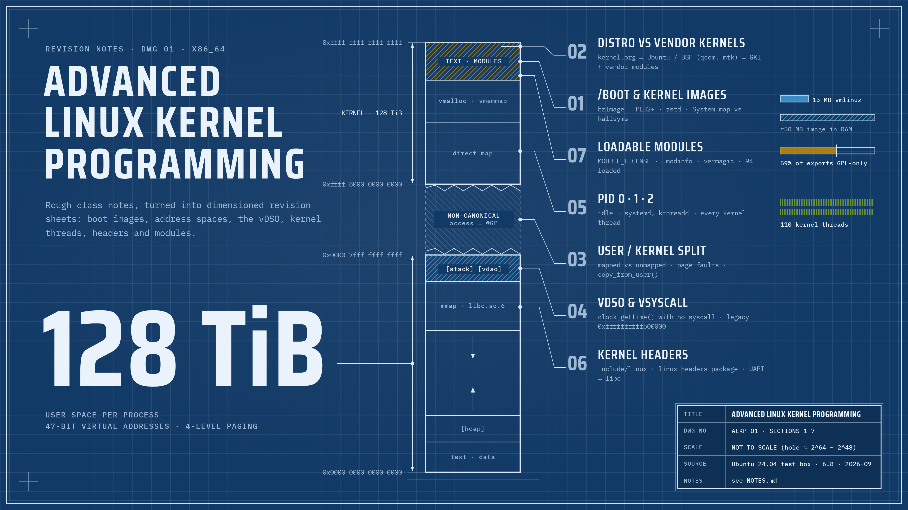

# Advanced Linux Kernel Programming



Revision notes from an Advanced Linux Kernel Programming course: rough class notes turned into clear, checked study notes.

## What's here

| Path | Contents |
| ---- | -------- |
| [`NOTES.md`](NOTES.md) | The revision notes: topics, diagrams, commands, pitfalls, revision questions, quick reference and glossary |
| [`examples/`](examples/) | Small kernel modules referenced from the notes, each with a `Makefile` |
| [`assets/`](assets/) | README banner (`banner.png`) and its HTML source |

## Topics so far

1. `/boot` and kernel images
2. Distribution vs vendor (BSP) kernels, GKI and licensing
3. Virtual address space: the user/kernel split
4. vDSO and vsyscall
5. PID 0, PID 1 and PID 2 (`kthreadd`), kernel threads
6. Kernel headers: in-tree, module-build and UAPI
7. Loadable kernel modules

## Building an example

On a Linux machine with the headers for the running kernel installed:

```sh
sudo apt install linux-headers-$(uname -r)   # Debian/Ubuntu: headers for the running kernel
cd examples/hello_module                     # pick an example
make                                         # builds hello.ko against /lib/modules/$(uname -r)/build
```

Examples are built and checked on Ubuntu 24.04 x86_64 (kernel 6.8). Load them only on a test machine or VM.
